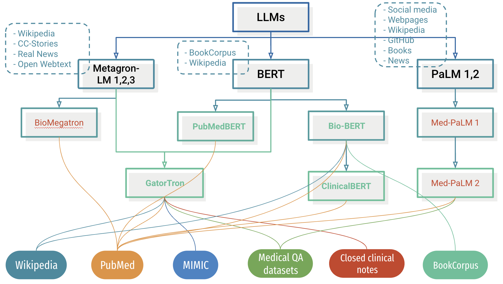
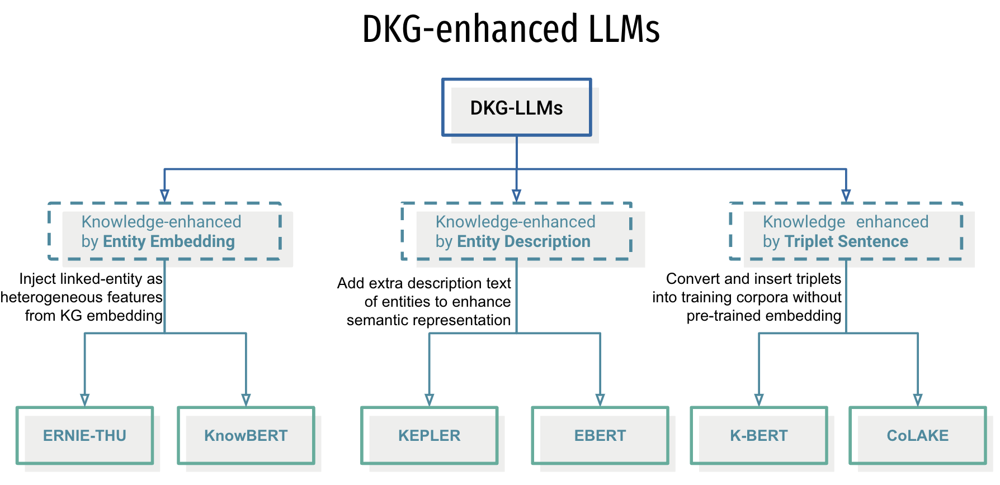

# MedicalLLMs
This repository is for collecting and updating existing and upcoming LLM tools and papers focusing on healthcare and medicine domain.

## Summary of LLMs in medicine, healthcare, and clinical settings. 
This table is updated by 12 October 2023 including GatorTron, Bio-BERT, PubMedBert, BioMegatron, ClinicalBERT, Med-PaLM 1 & 2.

  | Model | Paper | Code | Complexity | Data | Tasks |
  |---|---|---|---|---|---|
  | GatorTron | [Link](https://doi.org/10.1038/s41746-022-00742-2)  | [NVIDIA](https://catalog.ngc.nvidia.com/orgs/nvidia/teams/clara/models/gatortron_og)  [Hugging Face](https://huggingface.co/UFNLP/gatortron-base) | Base: 345M  Medium: 3.90B  Large: 8.90B | 1. [n2c2 NLP datasets](https://portal.dbmi.hms.harvard.edu/projects/n2c2-nlp/)   2. [MedNLI dataset](https://physionet.org/content/mednli/1.0.0/)   3. [emrQA dataset](https://github.com/panushri25/emrQA#download-dataset)   4. [MIMIC III dataset](https://physionet.org/content/mimiciii/1.4/)   5. [PubMed dataset](https://www.ncbi.nlm.nih.gov/pmc/tools/openftlist/)   6. [Wikipedia dataset](https://dumps.wikimedia.org/enwiki/latest/enwiki-latest-pages-articles.xml.bz2)   7. UF clinical notes (Close) | - Concept extraction  - Relation extraction  - Semantic textual similarity  - Natural language inference (NLI)  - Question answering  |
  | Bio-BERT  | [Link](https://doi.org/10.1093/bioinformatics/btz682)  | [Github](https://github.com/dmis-lab/biobert)  | [BERT](https://www.aclweb.org/anthology/N19-1423)(Wiki+Books): 1M  BioBERT(+PubMed): 1M  BioBERT(+PMC): 270K  BioBERT(+PubMed,PMC): 470K | 1. English Wikipedia  2. BooksCorpus  3. PubMed Abstracts  4. PMC Full-text articles  | - Name Entity Recognition (NER)  - Relation Extraction  - Question answering |
  | PubMedBert  | [Link](https://arxiv.org/abs/2007.15779)  | [Hugging Face](https://huggingface.co/microsoft/BiomedNLP-PubMedBERT-base-uncased-abstract-fulltext)  | Built-on [BERT](https://www.aclweb.org/anthology/N19-1423): 1M  | 1. PubMed Abstracts  2. PubMed Full-text | - NER  - Information extraction  - Relation extraction  - Semantic similarity  - Document classification  - Question answering  |
  | BioMegatron  | [Link](https://arxiv.org/pdf/2010.06060.pdf)  | Close  | Built-on [Metagron](https://doi.org/10.48550/arXiv.1909.08053): 8.3B  BioMegatron S: 345M  BioMegatron M: 800M  BioMegatron L: 1.2 B | **Megatron**:  1. [Wikipedia](https://arxiv.org/abs/1810.04805)  2. [CC-Stories](http://arxiv.org/abs/1806.02847)  3. [RealNews](http://arxiv.org/abs/1905.12616)  4. [OpenWebtext](https://openai.com/blog/better-language-models/)  **BioMegatron**:  5. [PubMed abstract](www.ncbi.nlm.nih.gov/pubmed) (4.5B)  6. [PMC full-text](www.ncbi.nlm.nih.gov/pubmed) (1.6B) | - NER  - Relation Extraction  - Question answering |
  | ClinicalBERT  | [Link](https://arxiv.org/pdf/1904.03323.pdf)  | [Github](https://github.com/EmilyAlsentzer/clinicalBERT)   [Hugging Face](https://huggingface.co/emilyalsentzer/Bio_ClinicalBER)  | Built-on BERT: 1M  Built-on BioBERT: 1M | [MIMIC all Clinical notes](https://physionet.org/content/mimic-iv-note/2.2/)  [MIMIC Discharge Summary](https://physionet.org/content/mimic-iv-note/2.2/) | - NER  - Concept extraction  - NLI |
  | Med-PaLM1 | [Link](https://doi.org/10.1038/s41586-023-06291-2)  | Close | Built-on [PaLM](https://doi.org/10.48550/arXiv.2204.02311): 540B | **MultiMedQA:**  (medical exams & research datasets)  1. [MedQA](https://www.nature.com/articles/s41586-023-06291-2#ref-CR3)  2. [MedMCQA](https://www.nature.com/articles/s41586-023-06291-2#ref-CR4)  3. [PubMedQA](https://www.nature.com/articles/s41586-023-06291-2#ref-CR5)  4. [LiveQA](https://www.nature.com/articles/s41586-023-06291-2#ref-CR13)  5. [MedicationQA](https://www.nature.com/articles/s41586-023-06291-2#ref-CR14)  6. [MMLU clinical topics](https://www.nature.com/articles/s41586-023-06291-2#ref-CR6)  **HealthSearchQA**  (curated searched health queries)  7.[HealthSearchQA](https://static-content.springer.com/esm/art%3A10.1038%2Fs41586-023-06291-2/MediaObjects/41586_2023_6291_MOESM6_ESM.xlsx) | Question answering  |
  | Med-PaLM2  | [Link](https://arxiv.org/pdf/2305.09617.pdf)  | Close  | Based on [PaLM 2](https://ai.google/static/documents/palm2techreport.pdf) | 1. [MedQA](https://www.nature.com/articles/s41586-023-06291-2#ref-CR3)  2. [MedMCQA](https://www.nature.com/articles/s41586-023-06291-2#ref-CR4)  3. [PubMedQA](https://www.nature.com/articles/s41586-023-06291-2#ref-CR5)  4. [MMLU clinical topics](https://www.nature.com/articles/s41586-023-06291-2#ref-CR6)  5. [HealthSearchQA](https://static-content.springer.com/esm/art%3A10.1038%2Fs41586-023-06291-2/MediaObjects/41586_2023_6291_MOESM6_ESM.xlsx)  6. [LiveQA](https://lhncbc.nlm.nih.gov/LHC-publications/PDF/pub9773.pdf)  7. [MedicationQA](https://pubmed.ncbi.nlm.nih.gov/31437878/) | Question answering |

## Evaluation methods / Benchmarks
  | Platform | Paper | Code | Tasks | Metrics | Datasets |
  |---|---|---|---|---|---|
  | [HELM](https://crfm.stanford.edu/helm/latest/) | [Link](https://arxiv.org/pdf/2211.09110.pdf) | [Github](https://github.com/stanford-crfm/helm) | - Question answering  - Information retrieval  - Summarization  - Sentiment analysis  - Reasoning  ... other 12 tasks | Accuracy, Calibration,  Robustness, Fairness, Bias,  Toxicity, Efficiency, General Info,   Summarization, Disinformation,   Copyright, Classification,  AAPS Metrics,>and BBQ Metrics | [Download Page](https://crfm.stanford.edu/helm/latest/?scenarios=1) |
  | [BLURB](https://microsoft.github.io/BLURB/) | [Link](https://arxiv.org/abs/2007.15779) | 404 | - NER  - Question answering  - Information retrieval  - Relation extraction  - Semantic similarity  - Classification | Accuracy (F1, correlation) | [Download Page](https://microsoft.github.io/BLURB/tasks.html) |
  | [GLUE](https://gluebenchmark.com/) | [Link](https://openreview.net/pdf?id=rJ4km2R5t7) | [Github](https://github.com/nyu-mll/GLUE-baselines) | - Question answering  - Semantic similarity  - NLI  - Sentiment analysis  - Coreference resolution | Accuracy (F1, correlation) | [Download Page](https://gluebenchmark.com/tasks) |
  | [SUPERGLUE](https://super.gluebenchmark.com/) | [Link](https://arxiv.org/abs/1905.00537) | [Github](https://github.com/nyu-mll/jiant) | - Question answering  - Reasoning  - Classification  - Text Entailment  - Coreference resolution | Accuracy (F1, correlation) | [Download Page](https://super.gluebenchmark.com/tasks) |

## Summary of Knowledge-enhanced LLMs 
There is a comprehensive review paper on Knowledge-enhanced LLM: [A Survey of Knowledge Enhanced Pre-Trained Language Models](https://doi.org/10.1109/TKDE.2023.3310002)
A comparable work of Knowledge-enhanced medical LLM: [SMedBERT: A Knowledge-Enhanced Pre-trained Language Model with Structured Semantics for Medical Text Mining](https://aclanthology.org/2021.acl-long.457.pdf)

